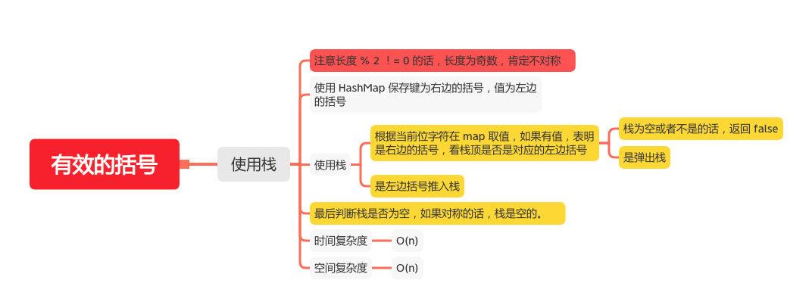

有效的括号
========

#### [20. 有效的括号](https://leetcode-cn.com/problems/valid-parentheses/)



### 使用栈
```java
 public static boolean isValid(String s) {
        if (s == null) {
            return true;
        }
        int n = s.length();
        // 注意长度 % 2 ！= 0 的话，长度为奇数，肯定不对称
        if (n % 2 != 0) {
            return false;
        }
        Deque<Character> stack = new LinkedList<Character>();
        // 使用 HashMap 保存键为右边的括号，值为左边的括号
        Map<Character,Character> map = new HashMap<Character,Character>(){
            {
                put(')','(');
                put(']','[');
                put('}','{');
            }
        };
        for (int i = 0; i < n; i++) {
            char ch = s.charAt(i);
            Character pairs = map.get(ch);
            // 根据当前位字符在 map 取值，如果有值，表明是右边的括号，看栈顶是否是对应的左边括号
            if (pairs != null) {
                // 栈为空或者不是的话，返回 false
                if (stack.isEmpty() || stack.peek() != pairs){
                    return false;
                }
                // 是弹出栈
                stack.pop();
            }else {
                // 是左边括号推入栈
                stack.push(ch);
            }
        }
        // 最后判断栈是否为空，如果对称的话，栈是空的。
        return stack.isEmpty();

    }
```