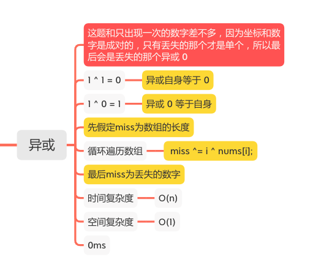
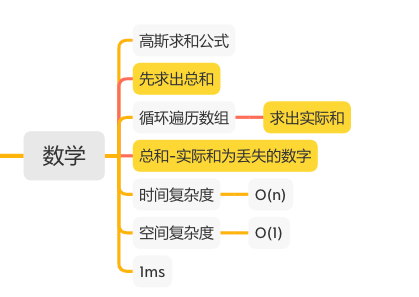
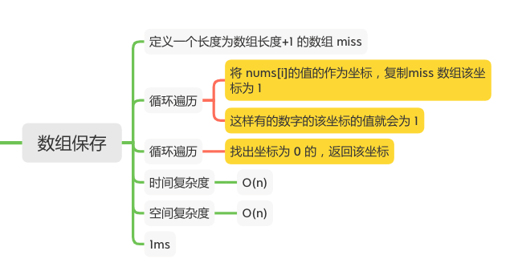
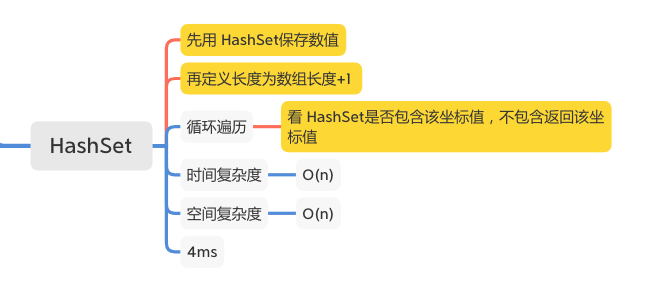
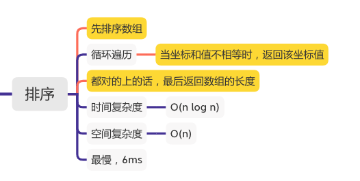

丢失的数字
========

#### [268. 丢失的数字](https://leetcode-cn.com/problems/missing-number/)











### 异或
```java
    public int missingNumber(int[] nums) {
        if (nums == null || nums.length == 0) {
            return 0;
        }
        int miss = nums.length;
        for (int i = 0; i < nums.length; i++) {
            miss ^= i ^ nums[i];
        }
        return miss;
    }
```

### 数学
```java
    public int missingNumber(int[] nums) {
        if (nums == null || nums.length == 0) {
            return 0;
        }
        // 先求出总和
        int expectedSum = nums.length * (nums.length + 1) / 2;
        int actualSum = 0;
        // 求出实际和
        for (int num : nums) {
            actualSum += num;
        }
        // 总和-实际和为丢失的数字
        return expectedSum - actualSum;
    }
```

### 数组保存
```java
    public int missingNumber(int[] nums) {
        if (nums == null || nums.length == 0) {
            return 0;
        }
        int[] miss = new int[nums.length + 1];
        for (int i = 0; i < nums.length; i++) {
            // 将 nums[i]的值的作为坐标，复制miss 数组该坐标为 1
            // 这样有的数字的该坐标的值就会为 1
            miss[nums[i]] = 1;
        }
        for (int i = 0; i < miss.length; i++) {
            // 找出坐标为 0 的，返回该坐标
            if (miss[i] == 0) {
                return i;
            }
        }
        return 0;
    }
```

### HashSet
```java
    public int missingNumber(int[] nums) {
        if (nums == null || nums.length == 0) {
            return 0;
        }
        Set<Integer> set = new HashSet<>(nums.length);
        // 先用 HashSet保存数值
        for (int num : nums) {
            set.add(num);
        }
        // 再定义长度为数组长度+1
        int len = nums.length + 1;
        for (int i = 0; i < len; i++) {
            // 看 HashSet是否包含该坐标值，不包含返回该坐标值
            if (!set.contains(i)) {
                return i;
            }
        }
        return -1;
    }
```

### 排序
```java
    public int missingNumber(int[] nums) {
        // 先排序数组
        Arrays.sort(nums);
        int len = nums.length;
        for (int i = 0; i < len; i++) {
            // 当坐标和值不相等时，返回该坐标值
            if (nums[i] != i) {
                return i;
            }
        }
        // 都对的上的话，最后返回数组的长度
        return nums.length;
    }
```