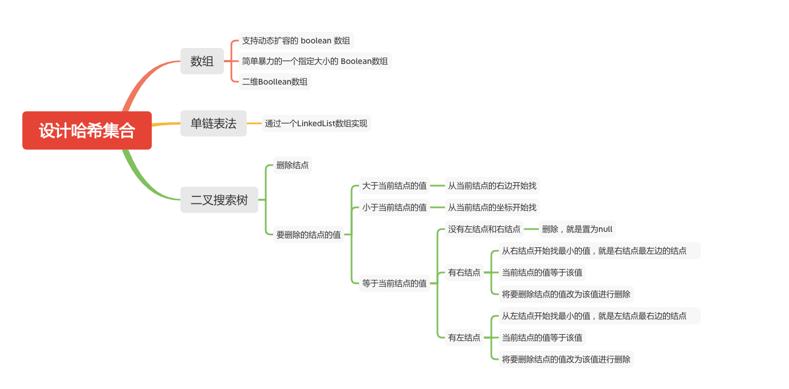

设计哈希集合
==========



不使用任何内建的哈希表库设计一个哈希集合

具体地说，你的设计应该包含以下的功能
	- add(value)：向哈希集合中插入一个值。
	- contains(value) ：返回哈希集合中是否存在这个值。
	- remove(value)：将给定值从哈希集合中删除。如果哈希集合中没有这个值，什么也不做。

#### 示例:
```java
MyHashSet hashSet = new MyHashSet();
hashSet.add(1);         
hashSet.add(2);         
hashSet.contains(1);    // 返回 true
hashSet.contains(3);    // 返回 false (未找到)
hashSet.add(2);          
hashSet.contains(2);    // 返回 true
hashSet.remove(2);          
hashSet.contains(2);    // 返回  false (已经被删除)
```
#### 注意：
- 所有的值都在 [0, 1000000]的范围内。
- 操作的总数目在[1, 10000]范围内。
- 不要使用内建的哈希集合库。

### 单链表法
- 使用LinkedList，ArrayList 效率没那么高
```java
public class MyHashSet {
    private Bucket[] bucketArray;
    private int keyRange;

    /**
     * Initialize your data structure here.
     */
    public MyHashSet() {
        // 设置 key 的范围,值过小或过大将影响效率
        keyRange = 769;
        bucketArray = new Bucket[keyRange];
        for (int i = 0; i < keyRange; ++i){
            bucketArray[i] = new Bucket();
        }
    }

    protected int _hash(int key) {
        // 哈希算法
        return (key % keyRange);
    }

    public void add(int key) {
        // 计算下标
        int bucketIndex = _hash(key);
        bucketArray[bucketIndex].insert(key);
    }

    public void remove(int key) {
        // 计算下标
        int bucketIndex = _hash(key);
        bucketArray[bucketIndex].delete(key);
    }

    /**
     * Returns true if set contains the specified element
     */
    public boolean contains(int key) {
        // 计算下标
        int bucketIndex = _hash(key);
        return bucketArray[bucketIndex].exists(key);
    }

    public static class Bucket {
        private LinkedList<Integer> container;

        public Bucket() {
            container = new LinkedList<Integer>();
        }

        public void insert(Integer key) {
            // 是否包含要插入的
            if (!exists(key)) {
                // 没有包含插入到第一个
                container.addFirst(key);
            }
        }

        public void delete(Integer key) {
            // 删除指定的 key
            container.remove(key);
        }

        public boolean exists(Integer key) {
            // 是否存在key
            return (container.indexOf(key) != -1);
        }
    }
}
```

### 二叉搜索树
```JAVA
    private Bucket[] bucketArray;
    private int keyRange;

    public MyHashSet() {
        keyRange = 769;
        bucketArray = new Bucket[keyRange];
        for (int i = 0; i < keyRange; ++i)
            bucketArray[i] = new Bucket();
    }

    protected int _hash(int key) {
        return (key % keyRange);
    }

    public void add(int key) {
        int bucketIndex = _hash(key);
        bucketArray[bucketIndex].insert(key);
    }

    public void remove(int key) {
        int bucketIndex = _hash(key);
        bucketArray[bucketIndex].delete(key);
    }

    public boolean contains(int key) {
        int bucketIndex = _hash(key);
        return bucketArray[bucketIndex].exists(key);
    }
    
    public static class Bucket {
        private BSTree tree;

        public Bucket() {
            tree = new BSTree();
        }

        public void insert(Integer key) {
            tree.root = tree.insertIntoBST(tree.root, key);
        }

        public void delete(Integer key) {
            tree.root = tree.deleteNode(tree.root, key);
        }

        public boolean exists(Integer key) {
            TreeNode node = tree.searchBST(tree.root, key);
            return (node != null);
        }
    }
    
    public static class TreeNode {
        int val;
        TreeNode left;
        TreeNode right;

        TreeNode(int x) {
            val = x;
        }
    }
    public static class BSTree {
        TreeNode root = null;

        public TreeNode searchBST(TreeNode root, int val) {
            if (root == null || val == root.val)
                return root;

            return val < root.val ? searchBST(root.left, val) : searchBST(root.right, val);
        }

        public TreeNode insertIntoBST(TreeNode root, int val) {
            if (root == null)
                return new TreeNode(val);
            System.out.println(root.val);
            if (val > root.val)
                // insert into the right subtree
                root.right = insertIntoBST(root.right, val);
            else if (val == root.val)
                // skip the insertion
                return root;
            else
                // insert into the left subtree
                root.left = insertIntoBST(root.left, val);
            return root;
        }

        /*
         * One step right and then always left
         */
        public int successor(TreeNode root) {
            root = root.right;
            while (root.left != null)
                root = root.left;
            return root.val;
        }

        /*
         * One step left and then always right
         */
        public int predecessor(TreeNode root) {
            root = root.left;
            while (root.right != null)
                root = root.right;
            return root.val;
        }

        public TreeNode deleteNode(TreeNode root, int key) {
            if (root == null)
                return null;

            if (key > root.val) {
                // delete from the right subtree
                // 从右边子树开始删除
                root.right = deleteNode(root.right, key);
            } else if (key < root.val) {
                // delete from the left subtree
                // 从左边子树开始删除
                root.left = deleteNode(root.left, key);
            } else {
                // delete the current node
                // 删除当前结点
                if (root.left == null && root.right == null){
                    // 没有结点置空
                    // the node is a leaf
                    root = null;
                } else if (root.right != null) {
                    // the node is not a leaf and has a right child
                    // 右边有结点，找到右边最小值，也就是右结点的值，或者右结点最左边的值
                    root.val = successor(root);
                    root.right = deleteNode(root.right, root.val);
                } else {
                    // the node is not a leaf, has no right child, and has a left child
                    // 左边有结点，找到左边最大值，也就是左结点的值，或者左结点最右边的值
                    root.val = predecessor(root);
                    root.left = deleteNode(root.left, root.val);
                }
            }
            return root;
        }

    }
    
```

### 数组

- 使用一维数组，动态扩容
```JAVA
    boolean[] arr;

    public MyHashSet() {
        arr = new boolean[100];
    }

    public void add(int key) {
        // 大于当前长度的时候需要动态扩容
        // 当 add 1 hou add 10000也是蛋疼
        if (key >= arr.length)
            extend(key);
        arr[key] = true;
    }

    public void remove(int key) {
        if (key < arr.length && arr[key]){
            arr[key] = false;
        }
    }

    public boolean contains(int key) {
        if (key >= arr.length)
            return false;
        return arr[key];
    }

    public void extend(int key) {
        // 使用的是系统的copy,效率比较高
        arr = Arrays.copyOf(arr, key + 2);
    }
```

- 最简单粗暴。。。不推荐，只针对限定条件有效，无法 hold住超出限定条件
```JAVA
public class MyHashSet {
    
    boolean[] set;

    public MyHashSet() {
        set = new boolean[1000001];
    }

    public void add(int key) {
        set[key] = true;
    }

    public void remove(int key) {
        set[key] = false;
    }


    public boolean contains(int key) {
        return set[key];
    }
}
```

- 使用二维数组，需要注意的是当前行数的数组是否为空。。不推荐，只针对限定条件有效，无法 hold住超出限定条件
```java
public class MyHashSet {

    boolean[][] arr;

    /**
     * Initialize your data structure here.
     */
    public MyHashSet() {
        // 只是初始化了一维数组，二维数组没有初始化，add 的时候动态添加
        arr = new boolean[1000][];
    }

    public void add(int key) {
        int[] pos = getPos(key);
        int row = pos[0];
        int col = pos[1];
        // 如果指定行数为空，需要新建
        if (arr[row] == null) {
            arr[row] = new boolean[1000];
        }
        // 设置为 true
        arr[row][col] = true;
    }

    public void remove(int key) {
        int[] pos = getPos(key);
        int row = pos[0];
        int col = pos[1];
        // 指定行数不为空，之前已经 add 过的，设置为 false，这点需要判断
        if (arr[row] != null) {
            arr[row][col] = false;
        }
    }
    
    public boolean contains(int key) {
        int[] pos = getPos(key);
        int row = pos[0];
        int col = pos[1];
        // 指定行数为空，之前没有add 过，直接返回 false，这点需要判断
        if (arr[row] == null) {
            return false;
        }
        return arr[row][col];
    }

    /**
     * 计算得到坐标
     * @param key
     * @return
     */
    private int[] getPos(int key) {
        // 计算位于哪行
        int row = key / 1000;
        // 计算位于哪列
        int col = key % 1000;
        // 返回坐标
        return new int[]{row, col};
    }
}
```

#### 参考文章

- [705. 设计哈希集合](https://leetcode-cn.com/problems/design-hashset/)


