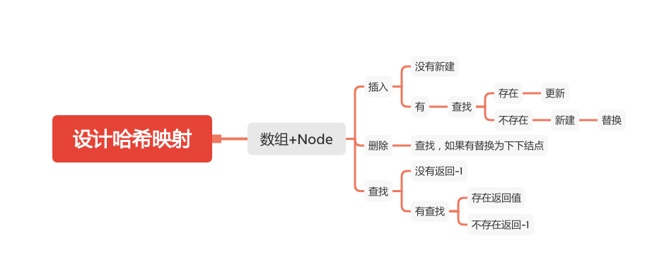

设计哈希映射
==========



不使用任何内建的哈希表库设计一个哈希映射

具体地说，你的设计应该包含以下的功能
- put(key, value)：向哈希映射中插入(键,值)的数值对。如果键对应的值已经存在，更新这个值。
- get(key)：返回给定的键所对应的值，如果映射中不包含这个键，返回-1。
- remove(key)：如果映射中存在这个键，删除这个数值对。

#### 示例：
```
MyHashMap hashMap = new MyHashMap();
hashMap.put(1, 1);          
hashMap.put(2, 2);         
hashMap.get(1);            // 返回 1
hashMap.get(3);            // 返回 -1 (未找到)
hashMap.put(2, 1);         // 更新已有的值
hashMap.get(2);            // 返回 1 
hashMap.remove(2);         // 删除键为2的数据
hashMap.get(2);            // 返回 -1 (未找到) 
```
#### 注意：

- 所有的值都在 [0, 1000000]的范围内。
- 操作的总数目在[1, 10000]范围内。
- 不要使用内建的哈希库。


### 数组 + Node
```java
public class MyHashMap {
    Node[] table;
    private int key_space = 2069;

    public MyHashMap() {
        table = new Node[2069];
    }

    /**
     * value will always be non-negative.
     */
    public void put(int key, int value) {
        int code = hashcode(key);
        Node temp = table[code];
        if (temp == null) {
            // 没有新建
            table[code] = new Node(key, value);
        } else {
            // 有查看是否包含
            while (temp != null) {
                if (temp.key == key) {
                    // 包含替换该值
                    temp.value = value;
                    return;
                }
                temp = temp.next;
            }
            // 没有新建，将头结点置为新换的
            Node t = new Node(key, value);
            t.next = table[code];
            table[code] = t;
        }
    }

    public int get(int key) {
        int code = hashcode(key);
        Node temp = table[code];
        // 为空直接返回-1
        if (temp == null) {
            return -1;
        }
        // 不为空查找是否存在
        while (temp != null) {
            if (temp.key == key) {
                return temp.value;
            }
            temp = temp.next;
        }
        // 不存在返回-1
        return -1;
    }

    public void remove(int key) {
        int code = hashcode(key);
        Node dummy = new Node(-1, -1);
        dummy.next = table[code];
        Node cur = dummy;
        while (cur.next != null) {
            if (cur.next.key == key) {
                // 存在 key，将当前结点的 下一个结点 置为 下下一个结点
                cur.next = cur.next.next;
                break;
            }
            cur = cur.next;
        }
        table[code] = dummy.next;
    }

    private int hashcode(int key) {
        // 计算 hashcode
        return key % key_space;
    }


    public static class Node {
        public int key;
        int value;
        private Node next;

        Node(int k, int v) {
            key = k;
            value = v;
        }
    }
}
```

#### 参考文章
- [706. 设计哈希映射](https://leetcode-cn.com/problems/design-hashmap/)

