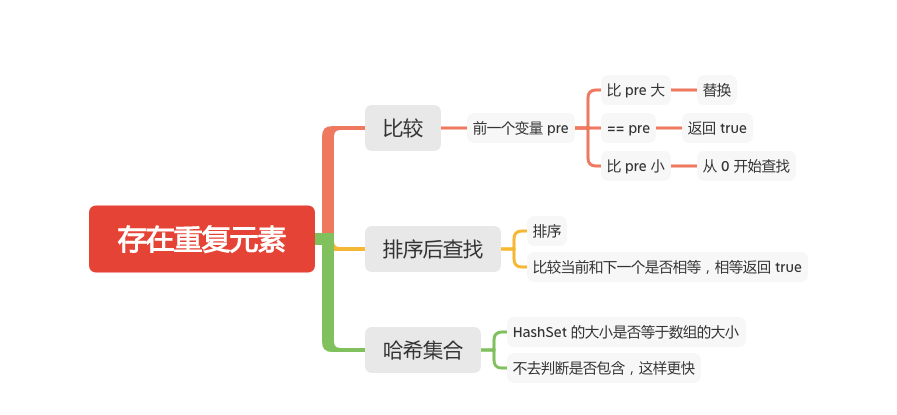

存在重复元素
==========



给定一个整数数组，判断是否存在重复元素。

如果任意一值在数组中出现至少两次，函数返回 true 。如果数组中每个元素都不相同，则返回 false 。

#### 示例 1:
```
输入: [1,2,3,1]
输出: true
```

#### 示例 2:
```
输入: [1,2,3,4]
输出: false
```

#### 示例 3:
```
输入: [1,1,1,3,3,4,3,2,4,2]
输出: true
```

### 比较
```java
    public boolean containsDuplicate(int[] nums) {
        if (nums == null || nums.length < 2) {
            return false;
        }
        int pre = nums[0];
        for (int i = 1; i < nums.length; i++) {
            if (pre < nums[i]) {
                // 大于替换
                pre = nums[i];
            } else if (pre == nums[i]) {
                // == 返回 true
                return true;
            } else {
                // 小于从 0 开始查找
                for (int j = 0; j < i; j++) {
                    if (nums[j] == nums[i]) {
                        return true;
                    }
                }
            }

        }
        return false;
    }
```

### 排序 + 比较
```java
    public boolean containsDuplicate(int[] nums) {
        if (nums == null || nums.length < 2) {
            return false;
        }
        Arrays.sort(nums);
        for (int i = 0; i < nums.length - 1; i++) {
            // 当前是否等于下一个
            if (nums[i] == nums[i + 1]) {
                return true;
            }
        }
        return false;
    }

```

### 哈希集合
```JAVA
    public boolean containsDuplicate(int[] nums) {
        if (nums == null || nums.length < 2) {
            return false;
        }
        Set<Integer> set = new HashSet<>(nums.length);
        for (int x : nums) {
            set.add(x);
        }
        return set.size() != nums.length;
    }
```

#### 参考文章
- [217. 存在重复元素](https://leetcode-cn.com/problems/contains-duplicate/)

