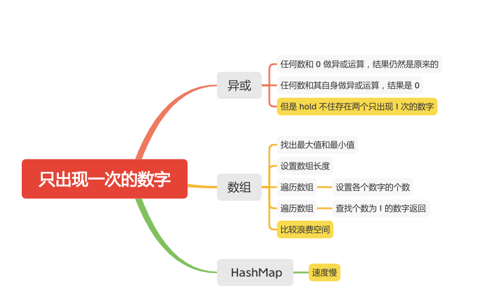

只出现一次的数字
=============




给定一个非空整数数组，除了某个元素只出现一次以外，其余每个元素均出现两次。找出那个只出现了一次的元素。

#### 说明：

你的算法应该具有线性时间复杂度。 你可以不使用额外空间来实现吗？

#### 示例 1:
```
输入: [2,2,1]
输出: 1
```
#### 示例 2:
```
输入: [4,1,2,1,2]
输出: 4
```

### 异或
```java
    public int singleNumber(int[] nums) {
        int res = 0;
        if (nums == null || nums.length == 0) {
            return res;
        }
        for (int i = 0; i < nums.length; i++) {
            res ^= nums[i];
        }
        return res;
    }
```
### 数组
```java
    public int singleNumber(int[] nums) {
        if (nums == null || nums.length == 0) {
            return -1;
        }
        int max, min;
        max = Integer.MIN_VALUE;
        min = Integer.MAX_VALUE;
        // 找出最大、最小
        for (int num : nums) {
            max = Math.max(max, num);
            min = Math.min(min, num);
        }
        // 数组长度是最大、最小区间大小
        int[] barrel = new int[max - min + 1];

        // 遍历整个数组、找出最大、最小区间里面各个数字的个数
        for (int i = nums.length - 1; i >= 0; i--) {
            barrel[nums[i] - min]++;
        }
        // 遍历整个区间
        for (int i = 0; i < barrel.length; i++) {
            if (barrel[i] == 1) {
                return min + i;
            }
        }
        return -1;
    }
```

### HashMap

```java
public int singleNumber1(int[] nums) {
    if (nums == null || nums.length == 0) {
        return -1;
    }
    Map<Integer, Integer> map = new HashMap<>();
    for (int i = 0; i < nums.length; i++) {
        map.put(nums[i], map.getOrDefault(nums[i], 0) + 1);

    }
    for (Map.Entry<Integer, Integer> entry : map.entrySet()) {
        if (entry.getValue() == 1) {
            return entry.getKey();
        }
    }
    return -1;
}
```

#### 参考文章
-  [136. 只出现一次的数字](https://leetcode-cn.com/problems/single-number/)

