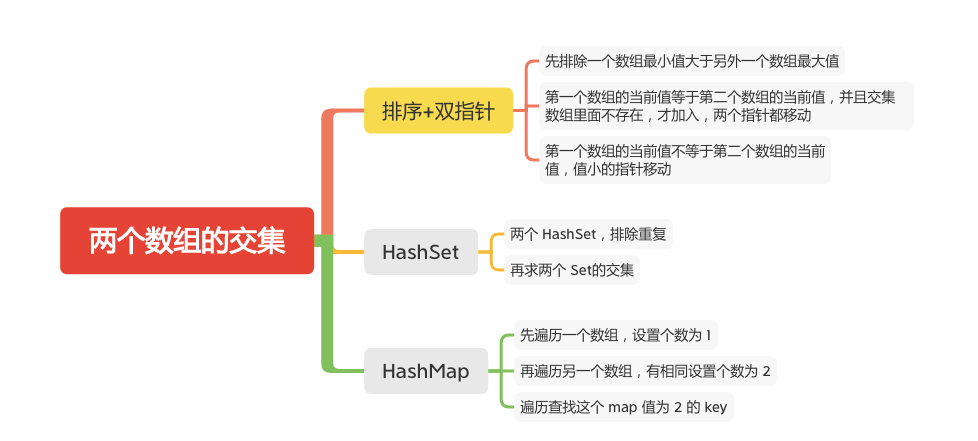

两个数组的交集
============



给定两个数组，编写一个函数来计算它们的交集。

#### 示例 1：
```
输入：nums1 = [1,2,2,1], nums2 = [2,2]
输出：[2]
```

#### 示例 2：
```
输入：nums1 = [4,9,5], nums2 = [9,4,9,8,4]
输出：[9,4]
```

### 排序+双指针
```JAVA
    public static int[] intersection(int[] nums1, int[] nums2) {
        if (nums1 == null || nums1.length == 0 || nums2 == null || nums2.length == 0) {
            return new int[]{};
        }
        Arrays.sort(nums1);
        Arrays.sort(nums2);
        // 先排除一个数组最小值大于另外一个数组最大值
        if (nums1[0] > nums2[nums2.length - 1] || nums2[0] > nums1[nums1.length - 1]) {
            return new int[]{};
        }
        int length1 = nums1.length, length2 = nums2.length;
        int[] intersection = new int[length1 + length2];
        int index = 0, index1 = 0, index2 = 0;
        while (index1 < length1 && index2 < length2) {
            int num1 = nums1[index1], num2 = nums2[index2];
            if (num1 == num2) {
                // 保证加入元素的唯一性
                // 第一个数组的当前值等于第二个数组的当前值，并且交集数组里面不存在，才加入，两个指针都移动
                if (index == 0 || num1 != intersection[index - 1]) {
                    intersection[index++] = num1;
                }
                index1++;
                index2++;
            } else if (num1 < num2) {
                // 移动第一个指针
                index1++;
            } else {
                // 移动第二个指针
                index2++;
            }
        }
        return Arrays.copyOfRange(intersection, 0, index);

    }
```

### HashSet
```JAVA
    public int[] intersection(int[] nums1, int[] nums2) {
        Set<Integer> set1 = new HashSet<Integer>();
        Set<Integer> set2 = new HashSet<Integer>();
        for (int num : nums1) {
            set1.add(num);
        }
        for (int num : nums2) {
            set2.add(num);
        }
        return getIntersection(set1, set2);
    }

    public int[] getIntersection(Set<Integer> set1, Set<Integer> set2) {
        if (set1.size() > set2.size()) {
            return getIntersection(set2, set1);
        }
        Set<Integer> intersectionSet = new HashSet<Integer>();
        for (int num : set1) {
            // 同时包含才加入
            if (set2.contains(num)) {
                intersectionSet.add(num);
            }
        }
        int[] intersection = new int[intersectionSet.size()];
        int index = 0;
        for (int num : intersectionSet) {
            intersection[index++] = num;
        }
        return intersection;
    }
```

### HashMap
```java
    public int[] intersection(int[] nums1, int[] nums2) {

        if (nums1 == null || nums1.length == 0 || nums2 == null || nums2.length == 0) {
            return new int[]{};
        }

        HashMap<Integer, Integer> maps = new HashMap<>();
        for (int i = 0; i < nums1.length; i++) {
            maps.put(nums1[i], 1);
        }
        for (int i = 0; i < nums2.length; i++) {
            if (maps.containsKey(nums2[i])) {
                maps.put(nums2[i], 2);
            }

        }

        ArrayList<Integer> list = new ArrayList<>();
        for (Map.Entry<Integer, Integer> entry : maps.entrySet()) {
            if (entry.getValue() == 2) {
                list.add(entry.getKey());
            }
        }
        int[] same = new int[list.size()];
        for (int i = 0; i < list.size(); i++) {
            same[i] = list.get(i);
        }
        return same;
    }
```


### 参考文章

- [349. 两个数组的交集](https://leetcode-cn.com/problems/intersection-of-two-arrays/)

