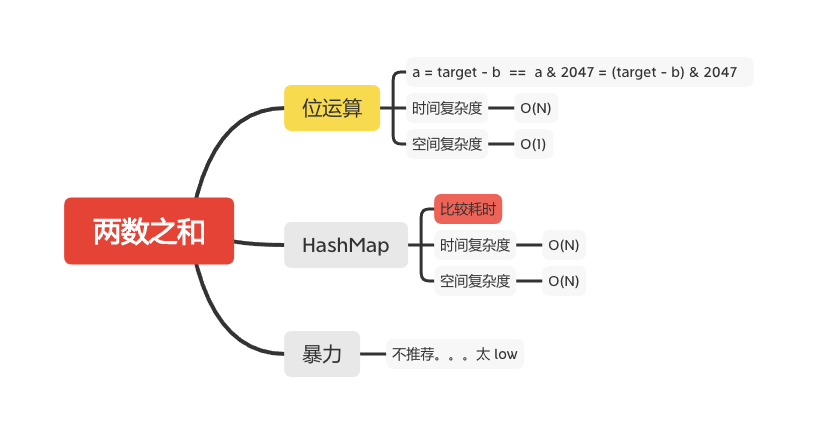

两数之和
======



给定一个整数数组 nums 和一个目标值 target，请你在该数组中找出和为目标值的那 两个 整数，并返回他们的数组下标。

你可以假设每种输入只会对应一个答案。但是，数组中同一个元素不能使用两遍。

 

#### 示例:
```
给定 nums = [2, 7, 11, 15], target = 9

因为 nums[0] + nums[1] = 2 + 7 = 9
所以返回 [0, 1]
```

### 位运算
```java
    public static int[] twoSum(int[] nums, int target) {

        int volume = 2<<10; //2048
        int bitNum = volume-1; //11111111111
        int[] res = new int[volume];
        // a = target - b -> a & 2047 = (target - b) & 2047
        for(int i=0;i<nums.length;i++){
            int c = (target-nums[i])&bitNum;
            if(res[c]!=0){
                return new int[]{res[c]-1,i};
            }
            res[nums[i]&bitNum] = i+1;
        }
        return new int[0];
    }

```

### HashMap
```java
    public static int[] twoSum(int[] nums, int target) {
        Map<Integer, Integer> map = new HashMap<Integer, Integer>();
        for (int i = 0; i < nums.length; ++i) {
            if (map.containsKey(target - nums[i])) {
                return new int[]{map.get(target - nums[i]), i};
            }
            map.put(nums[i], i);
        }
        return new int[0];
    }
```

#### 参考文章
-  [1. 两数之和](https://leetcode-cn.com/problems/two-sum/)

