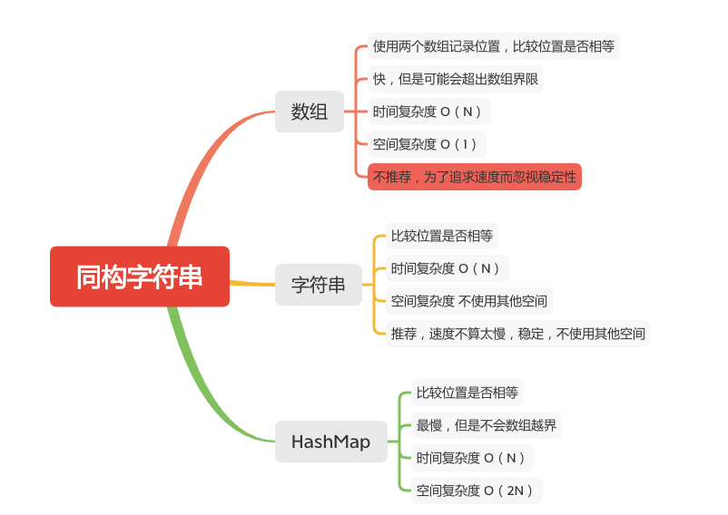

同构字符串
========



给定两个字符串 s 和 t，判断它们是否是同构的。

如果 s 中的字符可以被替换得到 t ，那么这两个字符串是同构的。

所有出现的字符都必须用另一个字符替换，同时保留字符的顺序。两个字符不能映射到同一个字符上，但字符可以映射自己本身。

#### 示例 1:
```
输入: s = "egg", t = "add"
输出: true
```

#### 示例 2:
```
输入: s = "foo", t = "bar"
输出: false
```

#### 示例 3:
```
输入: s = "paper", t = "title"
输出: true
```

#### 说明:
你可以假设 s 和 t 具有相同的长度。

### 字符串
```java
    public boolean isIsomorphic(String s, String t) {
        if (s == null || t == null) {
            return false;
        }
        if (s.length() != t.length()) {
            return false;
        }
        int length = s.length();
        for (int i = 0; i < length; i++) {
            if (s.indexOf(s.charAt(i),0) != t.indexOf(t.charAt(i),0)) {
                return false;
            }
        }
        return true;
    }
```

### HashMap
```java
    public static boolean isIsomorphic(String s, String t) {
        if (s == null || t == null) {
            return false;
        }

        if (s.length() != t.length()) {
            return false;
        }
        Map<Character, Integer> sMap = new HashMap<>();
        Map<Character, Integer> tMap = new HashMap<>();
        int length = s.length();
        for (int i = 0; i < length; i++) {
            int s1 = sMap.getOrDefault(s.charAt(i), -1);
            int s2 = tMap.getOrDefault(t.charAt(i), -1);
            if (s1 != s2) {
                return false;
            } else {
                if (s1 == -1) {
                    sMap.put(s.charAt(i), i);
                    tMap.put(t.charAt(i), i);
                }
            }
        }
        return true;
    }
```

### 数组
```java
    public static boolean isIsomorphic3(String s, String t) {
        if (s.length() != t.length()) return false;
        int len = s.length();
        int posS[] = new int[128];
        int posT[] = new int[128];
        char[] charS = s.toCharArray();
        char[] charT = t.toCharArray();

        for (int i = 0; i < len; i++) {
            if (posS[charS[i]] == 0) {
                posS[charS[i]] = i + 1;
            }
            if (posT[charT[i]] == 0) {
                posT[charT[i]] = i + 1;
            }
            if (posS[charS[i]] != posT[charT[i]]) return false;
        }
        return true;
    }
```

#### 参考文章
-  [205. 同构字符串](https://leetcode-cn.com/problems/isomorphic-strings/)

