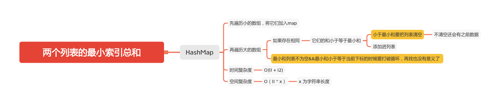

两个列表的最小索引总和
==================




假设Andy和Doris想在晚餐时选择一家餐厅，并且他们都有一个表示最喜爱餐厅的列表，每个餐厅的名字用字符串表示。

你需要帮助他们用最少的索引和找出他们共同喜爱的餐厅。 如果答案不止一个，则输出所有答案并且不考虑顺序。 你可以假设总是存在一个答案。

#### 示例 1:
```
输入:
["Shogun", "Tapioca Express", "Burger King", "KFC"]
["Piatti", "The Grill at Torrey Pines", "Hungry Hunter Steakhouse", "Shogun"]
输出: ["Shogun"]
解释: 他们唯一共同喜爱的餐厅是“Shogun”。
```

#### 示例 2:
```
输入:
["Shogun", "Tapioca Express", "Burger King", "KFC"]
["KFC", "Shogun", "Burger King"]
输出: ["Shogun"]
解释: 他们共同喜爱且具有最小索引和的餐厅是“Shogun”，它有最小的索引和1(0+1)。
```

#### 提示:
1. 两个列表的长度范围都在 [1, 1000]内。
1. 两个列表中的字符串的长度将在[1，30]的范围内。
1. 下标从0开始，到列表的长度减1。
1. 两个列表都没有重复的元素。

### HashMap
```java
    public static String[] findRestaurant(String[] list1, String[] list2) {
        if (list1 == null || list1.length == 0 || list2 == null || list2.length == 0) {
            return new String[]{};
        }
        if (list1.length > list2.length) {
            return findRestaurant(list2, list1);
        }

        Map<String, Integer> hash = new HashMap<>(list1.length, 1);
        List<String> list = new ArrayList<>();

        for (int i = 0; i < list1.length; i++) {
            hash.put(list1[i], i);
        }
        int minIndexSum = Integer.MAX_VALUE;
        for (int j = 0; j < list2.length; j++) {
            String restaurant = list2[j];
            // 查看是否有相同
            Integer i = hash.get(restaurant);
            if (i != null) {
                int sum = i + j;
                // 判断距离是否小于等于最小距离
                if (sum <= minIndexSum) {
                    if (sum < minIndexSum) {
                        minIndexSum = sum;
                        // 找到有更小的 要把之前的清掉
                        list.clear();
                    }
                    list.add(restaurant);
                }
            }
            // 已有最小和，并且最小和小于等于下标
            if (list.size() > 0 && minIndexSum <= j) {
                break;
            }
        }
        return list.toArray(new String[0]);
    }
```

#### 参考文章
- [599. 两个列表的最小索引总和](https://leetcode-cn.com/problems/minimum-index-sum-of-two-lists/)

