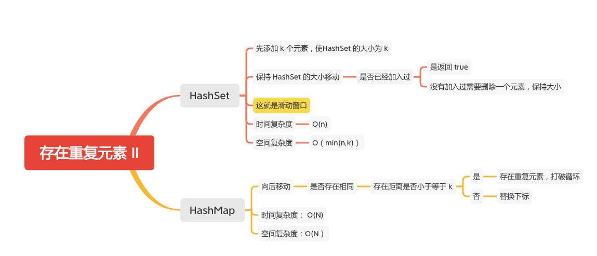

存在重复元素 II
===========



给定一个整数数组和一个整数 k，判断数组中是否存在两个不同的索引 i 和 j，使得 nums [i] = nums [j]，并且 i 和 j 的差的 绝对值 至多为 k。

#### 示例 1:
```
输入: nums = [1,2,3,1], k = 3
输出: true
```

#### 示例 2:
```
输入: nums = [1,0,1,1], k = 1
输出: true
```

#### 示例 3:
```
输入: nums = [1,2,3,1,2,3], k = 2
输出: false
```

### 滑动窗口
- 使用 HashSet
```java
    public static boolean containsNearbyDuplicate(int[] nums, int k) {
        if ( nums == null ||  nums.length < 2 || k <= 0) {
            return false;
        }
        Set<Integer> set = new HashSet<>();
        int begin = 0;
        int index = 0;
        // 先添加 K 个元素
        while (index < k && index < nums.length) {
            if (!set.add(nums[index])) {
                // 在 k 个元素里面存在相同的，返回 true
                return true;
            }
            index++;
        }
        // 从 K+1个元素开始遍历
        while (index < nums.length) {
            if (!set.add(nums[index])) {
                // 在 k 个元素里面存在相同的，返回 true
                return true;
            }
            // 删除一个，保持 set 的大小为 K
            set.remove(nums[begin]);
            index++;
            begin++;
        }
        return false;
    }
```

### HashMap
```java
    public static boolean containsNearbyDuplicate(int[] nums, int k) {
        if (nums == null || nums.length < 2 || k <= 0) {
            return false;
        }
        int count = 0;
        Map<Integer, Integer> maps = new HashMap<>();
        for (int i = 0; i < nums.length; i++) {
            if (maps.containsKey(nums[i])) {
                if (i - maps.get(nums[i]) <= k) {
                    count++;
                    break;
                } else {
                    maps.put(nums[i], i);
                }
            } else {
                maps.put(nums[i], i);
            }
        }
        return count != 0;
    }
```

#### 参考文章
- [219. 存在重复元素 II](https://leetcode-cn.com/problems/contains-duplicate-ii/)

