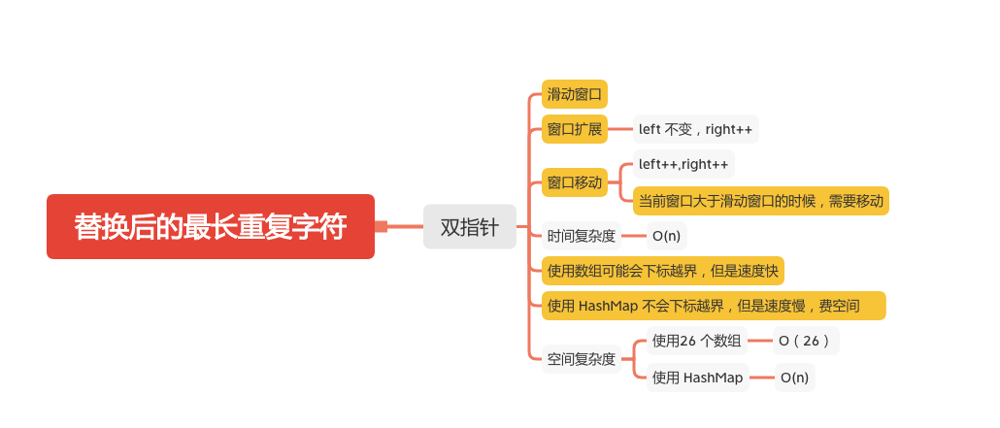

替换后的最长重复字符
================


给你一个仅由大写英文字母组成的字符串，你可以将任意位置上的字符替换成另外的字符，总共可最多替换 k 次。在执行上述操作后，找到包含重复字母的最长子串的长度。

注意:
字符串长度 和 k 不会超过 104。

#### 示例 1:
```
输入:
s = "ABAB", k = 2
输出:
4
解释:
用两个'A'替换为两个'B',反之亦然。
```

#### 示例 2:
```
输入:
s = "AABABBA", k = 1
输出:
4
解释:
将中间的一个'A'替换为'B',字符串变为 "AABBBBA"。
子串 "BBBB" 有最长重复字母, 答案为 4。
```
### 双指针+滑动窗口
- 使用数组，输入不是大写字母会下标越界
```java
    public int characterReplacement(String s, int k) {
        int[] map = new int[26];
        if (s == null) {
            return 0;
        }
        char[] chars = s.toCharArray();
        int left = 0;
        int right = 0;
        int historyCharMax = 0;
        for (right = 0; right < chars.length; right++) {
            int index = chars[right] - 'A';
            map[index]++;
            historyCharMax = Math.max(historyCharMax, map[index]);
            if (right - left + 1 > historyCharMax + k) {
                map[chars[left] - 'A']--;
                left++;
            }
        }
        return chars.length - left;
    }
```

- HashMap, 不会下标越界，但是速度慢，费空间
```JAVA
    public int characterReplacement1(String s, int k) {
        Map<Character,Integer> map = new HashMap<>();
        if (s == null) {
            return 0;
        }
        char[] chars = s.toCharArray();
        int left = 0;
        int right = 0;
        int historyCharMax = 0;
        for (right = 0; right < chars.length; right++) {
            Integer count = map.getOrDefault(chars[right],0);
            map.put(chars[right],++count);
            historyCharMax = Math.max(historyCharMax,count);
            // 窗口扩张：left不变，right++
            // 窗口滑动：left++, right++
            if (right - left + 1 > historyCharMax + k) {
                map.put(chars[left],map.get(chars[left])-1);
                left++;
            }
        }
        return chars.length - left;
    }
```

#### 参考文章
- [424. 替换后的最长重复字符](https://leetcode-cn.com/problems/longest-repeating-character-replacement/)

