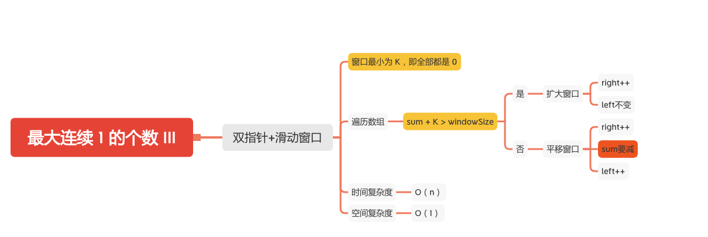

最大连续 1 的个数 III
================



给定一个由若干 0 和 1 组成的数组 A，我们最多可以将 K 个值从 0 变成 1 。

返回仅包含 1 的最长（连续）子数组的长度。


#### 示例 1：
```
输入：A = [1,1,1,0,0,0,1,1,1,1,0], K = 2
输出：6
解释： 
[1,1,1,0,0,1,1,1,1,1,1]
粗体数字从 0 翻转到 1，最长的子数组长度为 6。
```
#### 示例 2：
```
输入：A = [0,0,1,1,0,0,1,1,1,0,1,1,0,0,0,1,1,1,1], K = 3
输出：10
解释：
[0,0,1,1,1,1,1,1,1,1,1,1,0,0,0,1,1,1,1]
粗体数字从 0 翻转到 1，最长的子数组长度为 10。
```
#### 提示：
1. 1 <= A.length <= 20000
1. 0 <= K <= A.length
1. A[i] 为 0 或 1 

### 双指针+滑动窗口
```JAVA
    public int longestOnes(int[] A, int K) {
        if (A == null || K < 0) {
            return 0;
        }
        int sum = 0;
        int windowSize = 0;
        int right = 0;
        int left = 0;
        while (right < A.length) {
            sum += A[right];
            if (sum + K > windowSize) {
                // 扩大窗口大小
                windowSize++;
            } else {
                // sum要减去最左边
                sum -= A[left];
                // 平移窗口
                left++;
              
                
            }
            right++;
        }
        return windowSize;
    }
```

#### 参考文章
- [1004. 最大连续1的个数 III](https://leetcode-cn.com/problems/max-consecutive-ones-iii/)