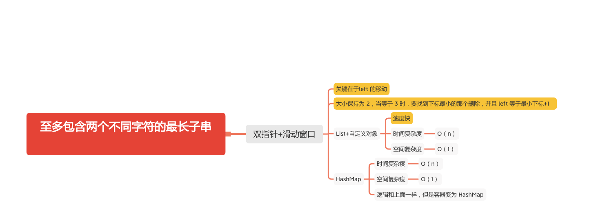

至多包含两个不同字符的最长子串
=========================



给定一个字符串 s ，找出 至多 包含两个不同字符的最长子串 t ，并返回该子串的长度。

#### 示例 1:
```
输入: "eceba"
输出: 3
解释: t 是 "ece"，长度为3。
```

####示例 2:
```
输入: "ccaabbb"
输出: 5
解释: t 是 "aabbb"，长度为5。
```

### 双指针加滑动窗口
- List + 自定义对象
```java
    public static int lengthOfLongestSubstringTwoDistinct(String s) {
        if (s == null || s.length() == 0) {
            return 0;
        }
        int len = s.length();
        List<CharAndPosition> list = new ArrayList<>();
        int left = 0, right = 0, max = 0;
        while (right < len) {
            char ch = s.charAt(right);
            if (list.size() < 3) {
                // 是否已经包含
                boolean contains = false;
                for (int i = 0; i < list.size(); i++) {
                    if (list.get(i).c == ch) {
                        // 置为 true
                        contains = true;
                        // 更新下标
                        list.get(i).pos = right++;
                        break;
                    }
                }
                if (!contains) {
                    // 不包含添加新的
                    list.add(new CharAndPosition(ch, right++));
                }

            }
            if (list.size() == 3) {
                // 比较前两个下标的大小，找到小的并删除，将 left 置为最小下标加 1
                int p1 = list.get(0).pos, p2 = list.get(1).pos;
                if (p1 < p2) {
                    left = p1 + 1;
                    list.remove(0);
                } else {
                    left = p2 + 1;
                    list.remove(1);
                }
            }
            max = Math.max(max, right - left);

        }
        return max;
    }

    public static class CharAndPosition {
        char c;
        int pos;

        CharAndPosition(char c1, int pos1) {
            this.c = c1;
            this.pos = pos1;
        }

        @Override
        public boolean equals(Object obj) {
            return this.c == ((CharAndPosition) obj).c;
        }
    }
```

- HashMap

```java
    public static int lengthOfLongestSubstringTwoDistinct(String s) {
        if (s == null) {
            return 0;
        }
        int n = s.length();
        if (n < 3) {
            return n;
        }
        int left = 0;
        int right = 0;
        HashMap<Character, Integer> hashmap = new HashMap<Character, Integer>();
        int max_len = 2;
        while (right < n) {
            if (hashmap.size() < 3) {
                // 大小小于3加入
                hashmap.put(s.charAt(right), right++);
            }
            // 大小等于 3 需要判断
            if (hashmap.size() == 3) {
                // 找到最小下标
                int del_idx = Collections.min(hashmap.values());
                // 删除最小下标
                hashmap.remove(s.charAt(del_idx));
                // 更新left 为最小下标加 1
                left = del_idx + 1;
            }

            max_len = Math.max(max_len, right - left);
        }
        return max_len;
    }
```

#### 参考文章
- [159. 至多包含两个不同字符的最长子串](https://leetcode-cn.com/problems/longest-substring-with-at-most-two-distinct-characters/)

