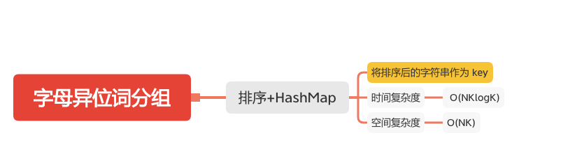

字母异位词分组
============



给定一个字符串数组，将字母异位词组合在一起。字母异位词指字母相同，但排列不同的字符串。

#### 示例:
```
输入: ["eat", "tea", "tan", "ate", "nat", "bat"]
输出:
[
  ["ate","eat","tea"],
  ["nat","tan"],
  ["bat"]
]
```

#### 说明：
- 所有输入均为小写字母。
- 不考虑答案输出的顺序。

### 排序+HashMap
```java
    public List<List<String>> groupAnagrams(String[] strs) {
        List<List<String>> groupAnagrams = new ArrayList<>();
        if (strs == null || strs.length == 0) {
            return groupAnagrams;
        }
        Map<String, List<String>> map = new HashMap<>();
        for (int i = 0; i < strs.length; i++) {
            char[] chars = strs[i].toCharArray();
            // 将 char 数组排序作为 key
            Arrays.sort(chars);
            String key = String.valueOf(chars);
            if (map.containsKey(key)) {
                map.get(key).add(strs[i]);
            } else {
                List<String> list = new ArrayList<>();
                list.add(strs[i]);
                map.put(key, list);
            }
        }
        groupAnagrams.addAll(map.values());
        return groupAnagrams;
    }

```

#### 参考文章
- [49. 字母异位词分组](https://leetcode-cn.com/problems/group-anagrams/)