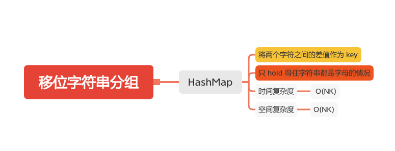

移位字符串分组
============



给定一个字符串，对该字符串可以进行 “移位” 的操作，也就是将字符串中每个字母都变为其在字母表中后续的字母，比如："abc" -> "bcd"。这样，我们可以持续进行 “移位” 操作，从而生成如下移位序列：

```
"abc" -> "bcd" -> ... -> "xyz"
```
给定一个包含仅小写字母字符串的列表，将该列表中所有满足 “移位” 操作规律的组合进行分组并返回。


#### 示例：
```
输入：["abc", "bcd", "acef", "xyz", "az", "ba", "a", "z"]
输出：
[
  ["abc","bcd","xyz"],
  ["az","ba"],
  ["acef"],
  ["a","z"]
]
解释：可以认为字母表首尾相接，所以 'z' 的后续为 'a'，所以 ["az","ba"] 也满足 “移位” 操作规律。
```

### HashMap 
- 将两个字符之间的差值作为 key
```java
    public List<List<String>> groupStrings(String[] strs) {
        List<List<String>> groupAnagrams = new ArrayList<>();
        if (strs == null || strs.length == 0) {
            return groupAnagrams;
        }
        Map<String, List<String>> map = new HashMap<>();
        for (int i = 0; i < strs.length; i++) {
            char[] chars = strs[i].toCharArray();

            StringBuilder stringBuilder = new StringBuilder();
            for (int j = 1; j < chars.length; j++) {
                int c = chars[j] < chars[j-1] ?  chars[j] - chars[j-1] + 26 :  chars[j] - chars[j-1] ;
                stringBuilder.append(c);
            }
            String key = String.valueOf(stringBuilder.toString());
            if (map.containsKey(key)) {
                map.get(key).add(strs[i]);
            } else {
                List<String> list = new ArrayList<>();
                list.add(strs[i]);
                map.put(key, list);
            }
        }
        groupAnagrams.addAll(map.values());
        return groupAnagrams;
    }
```

#### 参考文章

- [49. 字母异位词分组](https://leetcode-cn.com/problems/group-anagrams/)

