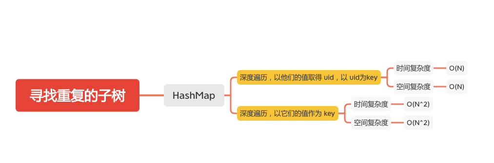

寻找重复的子树
===========



给定一棵二叉树，返回所有重复的子树。对于同一类的重复子树，你只需要返回其中任意一棵的根结点即可。

两棵树重复是指它们具有相同的结构以及相同的结点值。

#### 示例 1：
```
        1
       / \
      2   3
     /   / \
    4   2   4
       /
      4
```
下面是两个重复的子树：
```
      2
     /
    4
```
和
```
    4
```
因此，你需要以列表的形式返回上述重复子树的根结点。


### uid
- 深度遍历，以他们的值取得 uid，以 uid为key
```java
    int t;
    Map<String, Integer> trees;
    Map<Integer, Integer> count;
    List<TreeNode> ans;

    public List<TreeNode> findDuplicateSubtrees1(TreeNode root) {
        t = 1;
        trees = new HashMap();
        count = new HashMap();
        ans = new ArrayList();
        lookup(root);
        return ans;
    }

    public int lookup(TreeNode node) {
        if (node == null) return 0;
        String serial = node.val + "," + lookup(node.left) + "," + lookup(node.right);
        // 取得 uid
        int uid = trees.computeIfAbsent(serial, x -> t++);
        System.out.println("node.val = " + node.val + ", serial = " + serial + ", uid = " + uid);
        count.put(uid, count.getOrDefault(uid, 0) + 1);
        if (count.get(uid) == 2)
            ans.add(node);
        return uid;
    }
```

### 序列号
- 深度遍历，以它们的值作为 key
```java
    Map<String, Integer> count;
    List<TreeNode> ans;
    public List<TreeNode> findDuplicateSubtrees(TreeNode root) {
        count = new HashMap();
        ans = new ArrayList();
        collect(root);
        return ans;
    }

    public String collect(TreeNode node) {
        if (node == null) return "#";
        // 根据值生成序列号，以序列号作为 key
        String serial = node.val + "," + collect(node.left) + "," + collect(node.right);
        count.put(serial, count.getOrDefault(serial, 0) + 1);
        if (count.get(serial) == 2)
            ans.add(node);
        return serial;
    }
```

#### 参考文章

- [652. 寻找重复的子树](https://leetcode-cn.com/problems/find-duplicate-subtrees/)


