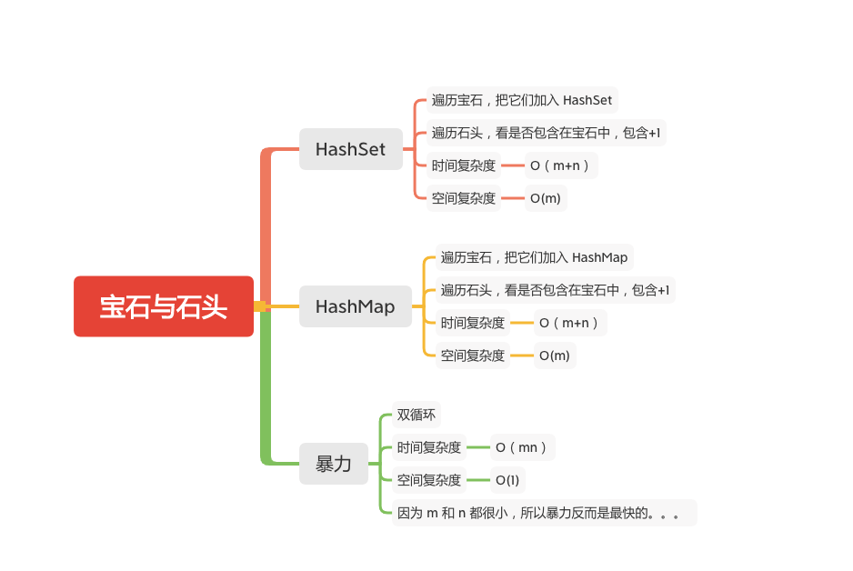

宝石与石头
========



 给定字符串J 代表石头中宝石的类型，和字符串 S代表你拥有的石头。 S 中每个字符代表了一种你拥有的石头的类型，你想知道你拥有的石头中有多少是宝石。

J 中的字母不重复，J 和 S中的所有字符都是字母。字母区分大小写，因此"a"和"A"是不同类型的石头。

### 示例 1:
```
输入: J = "aA", S = "aAAbbbb"
输出: 3
```

### 示例 2:
```
输入: J = "z", S = "ZZ"
输出: 0
```
注意:
   - S 和 J 最多含有50个字母。
   - J 中的字符不重复。

### HashSet
```java
    public int numJewelsInStones(String J, String S) {
        int num = 0;

        if (J == null || J.length() == 0 || S == null || S.length() == 0) {
            return num;
        }
        HashSet<Character> map = new HashSet<>();
        // 先遍历宝石
        for (int i = 0; i < J.length(); i++) {
            map.add(J.charAt(i));
        }
        // 再遍历石头
        for (int i = 0; i < S.length(); i++) {
            // 是否包含在宝石中
            if ( map.contains(S.charAt(i))) {
                num++;
            }
        }
        return num;
    }
```

### HashMap
```java
    public int numJewelsInStones(String J, String S) {
        int num = 0;

        if (J == null || J.length() == 0 || S == null || S.length() == 0) {
            return num;
        }
        Map<Character, Integer> map = new HashMap<>();
        // 先遍历宝石
        for (int i = 0; i < J.length(); i++) {
                map.put(J.charAt(i), 0);
        }
        // 再遍历石头
        for (int i = 0; i < S.length(); i++) {
            // 是否包含在宝石中
            if ( map.containsKey(S.charAt(i))) {
               num++;
            }
        }
        return num;
    }
```

### 暴力
```java
    public int numJewelsInStones(String J, String S) {
        int jewelsCount = 0;
        int jewelsLength = J.length(), stonesLength = S.length();
        for (int i = 0; i < stonesLength; i++) {
            char stone = S.charAt(i);
            for (int j = 0; j < jewelsLength; j++) {
                char jewel = J.charAt(j);
                if (stone == jewel) {
                    jewelsCount++;
                    break;
                }
            }
        }
        return jewelsCount;
    }
```

#### 参考文章
-  [771. 宝石与石头](https://leetcode-cn.com/problems/jewels-and-stones/)