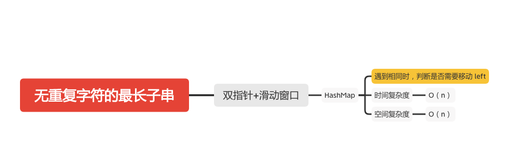

无重复字符的最长子串
=================



给定一个字符串，请你找出其中不含有重复字符的 最长子串 的长度。

#### 示例 1:
```
输入: "abcabcbb"
输出: 3 
解释: 因为无重复字符的最长子串是 "abc"，所以其长度为 3。
```
#### 示例 2:
```
输入: "bbbbb"
输出: 1
解释: 因为无重复字符的最长子串是 "b"，所以其长度为 1。
```

#### 示例 3:
```
输入: "pwwkew"
输出: 3
解释: 因为无重复字符的最长子串是 "wke"，所以其长度为 3。
     请注意，你的答案必须是 子串 的长度，"pwke" 是一个子序列，不是子串。
```
### 双指针+滑动窗口
```java
    public static int lengthOfLongestSubstring(String s) {

        if (s == null || s.length() == 0) {
            return 0;
        }
        int n = s.length();
        int left = 0;
        int right = 0;
        HashMap<Character, Integer> map = new HashMap<Character, Integer>();
        int max_len = 0;
        while (right < n) {
            if (map.containsKey((s.charAt(right)))) {
                // 判断是否需要移动 left
                left = Math.max(left, map.get(s.charAt(right)) + 1);
            }
            map.put(s.charAt(right), right++);

            max_len = Math.max(max_len, right - left);
        }
        return max_len;
    }

```

#### 参考文章
- [3. 无重复字符的最长子串](https://leetcode-cn.com/problems/longest-substring-without-repeating-characters/)

