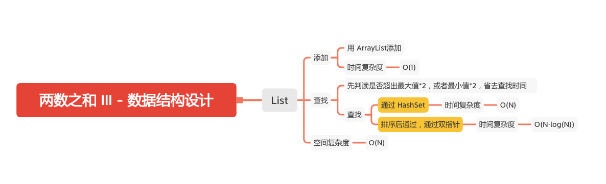

两数之和 III - 数据结构设
==================



设计一个接收整数流的数据结构，该数据结构支持检查是否存在两数之和等于特定值。

#### 实现 **TwoSum** 类：
```
TwoSum() 使用空数组初始化 TwoSum 对象
void add(int number) 向数据结构添加一个数 number
boolean find(int value) 寻找数据结构中是否存在一对整数，使得两数之和与给定的值相等。如果存在，返回 true ；否则，返回 false 。
```

#### 示例：
```
输入：
["TwoSum", "add", "add", "add", "find", "find"]
[[], [1], [3], [5], [4], [7]]
输出：
[null, null, null, null, true, false]

解释：
TwoSum twoSum = new TwoSum();
twoSum.add(1);   // [] --> [1]
twoSum.add(3);   // [1] --> [1,3]
twoSum.add(5);   // [1,3] --> [1,3,5]
twoSum.find(4);  // 1 + 3 = 4，返回 true
twoSum.find(7);  // 没有两个整数加起来等于 7 ，返回 false
```
#### 提示：
  - -10^5^ <= number <= 10^5^
  - -2^31^ <= value <= 2^31^ - 1
  - 最多调用 5 * 10^4^ 次 add 和 find

### 使用List
- find 方法没有注释的使用 HashSet 注释的使用排序加双指针
```JAVA
public class TwoSum {

    private final List<Integer> list;
    private long min = Integer.MAX_VALUE;
    private long max = Integer.MIN_VALUE;
    private long min2 = Integer.MAX_VALUE;
    private long max2 = Integer.MIN_VALUE;
    private boolean is_sorted;
    /**
     * Initialize your data structure here.
     */
    public TwoSum1() {
        list = new LinkedList<>();
    }

    /**
     * Add the number to an internal data structure..
     */
    public void add(int number) {
        list.add(number);
        min = Math.min(min, number);
        max = Math.max(max, number);
        min2 = min << 1;
        max2 = max << 1;
        is_sorted = false;
    }

    /**
     * Find if there exists any pair of numbers which sum is equal to the value.
     */
    public boolean find(int value) {
        if (value < min2 || value > max2) {
            return false;
        }
        Set<Integer> set = new HashSet<>();
        for (int i : list) {
            if (set.contains(value - i)) {
                // 包含差值返回 true
                return true;
            }
            // 没有添加进去
            set.add(i);
        }
        return false;
//        if (!is_sorted) {
//            Collections.sort(list);
//            is_sorted = true;
//        }
//        int low = 0, high = list.size() - 1;
//        while (low < high) {
//            int twosum = list.get(low) + list.get(high);
//            if (twosum < value){
//                // 小于向左移动
//                low += 1;
//            } else if (twosum > value){
//                // 大于向右移动
//                high -= 1;
//            }else {
//                // 相等返回 true
//                return true;
//            }
//        }
//        return false;
    }
```

#### 参考文章
- [70. 两数之和 III - 数据结构设计](https://leetcode-cn.com/problems/two-sum-iii-data-structure-design/)