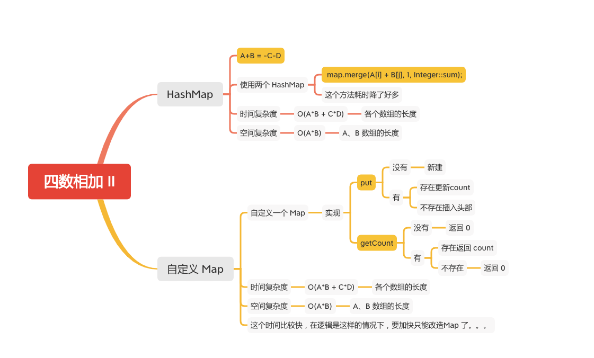

四数相加 II
========



给定四个包含整数的数组列表 A , B , C , D ,计算有多少个元组 (i, j, k, l) ，使得 A[i] + B[j] + C[k] + D[l] = 0。

为了使问题简单化，所有的 A, B, C, D 具有相同的长度 N，且 0 ≤ N ≤ 500 。所有整数的范围在 -228 到 228 - 1 之间，最终结果不会超过 231 - 1 。

例如:
```
输入:
A = [ 1, 2]
B = [-2,-1]
C = [-1, 2]
D = [ 0, 2]

输出:
2

解释:
两个元组如下:
1. (0, 0, 0, 1) -> A[0] + B[0] + C[0] + D[1] = 1 + (-2) + (-1) + 2 = 0
2. (1, 1, 0, 0) -> A[1] + B[1] + C[0] + D[0] = 2 + (-1) + (-1) + 0 = 0
```


### HashMap

```java
    public int fourSumCount(int[] A, int[] B, int[] C, int[] D) {
        int lenA = A.length, res = 0;
        int lenB = B.length;
        Map<Integer, Integer> map = new HashMap<>(lenA * lenB);

        for (int i = 0; i < lenA; i++) {
            for (int j = 0; j < lenB; j++) {
                map.merge(A[i] + B[j], 1, Integer::sum);
            }
        }
        int lenC = C.length, lenD = D.length;
        for (int i = 0; i < lenC; i++) {
            for (int j = 0; j < lenD; j++) {
                res += map.getOrDefault(-C[i] - D[j], 0);
            }
        }

        return res;
    }
```

### 自定义 Map
```java
    private static class Node {
        int value;
        int count;
        Node next;

        public Node(int value) {
            this.value = value;
            this.count = 1;
        }

        public Node(int value, Node next) {
            this.value = value;
            this.count = 1;
            this.next = next;
        }
    }

    private static class Map {

        Node[] table;

        public Map(int initalCapacity) {
            if (initalCapacity < 16) {
                initalCapacity = 16;
            } else {
                initalCapacity = Integer.highestOneBit(initalCapacity - 1) << 1;
            }
            table = new Node[initalCapacity];
        }

        // 拷贝的HashMap的hash方法
        private int hash(int value) {
            if (value < 0) {
                value = -value;
            }
            int h;
            return (value == 0) ? 0 : (h = value) ^ (h >>> 16);
        }

        public void put(int value) {
            int tableIndex = hash(value) & table.length - 1;
            Node head = table[tableIndex];
            if (head == null) {
                // 头部没有，新建一个
                table[tableIndex] = new Node(value);
                return;
            }
            Node cur = head;
            // 遍历node
            while (cur != null) {
                if (cur.value == value) {
                    // 已经存在，计数加+
                    cur.count++;
                    return;
                }
                cur = cur.next;
            }

            // 不存在，新建一个插入到头部
            table[tableIndex] = new Node(value, head);
        }

        public int getCount(int value) {
            int tableIndex = hash(value) & table.length - 1;
            Node head = table[tableIndex];
            // 不存在node 返回 0
            if (head == null) {
                return 0;
            }
            Node cur = head;
            // 遍历node
            while (cur != null) {
                if (cur.value == value) {
                    // 存在返回count
                    return cur.count;
                }
                cur = cur.next;
            }
            // 遍历完没有返回 0
            return 0;
        }
    }


    public int fourSumCount(int[] A, int[] B, int[] C, int[] D) {
        if (A == null || A.length == 0 || B == null || B.length == 0 || C == null || C.length == 0 || D == null || D
                .length == 0) {
            return 0;
        }
        // 避免扩容, 初始化一个最大初始容量
        Map abMap = new Map(A.length * B.length);

        for (int a : A) {
            for (int b : B) {
                abMap.put(a + b);
            }
        }

        int res = 0;
        for (int c : C) {
            for (int d : D) {
                res += abMap.getCount(-c - d);
            }
        }
        return res;
    }
```

#### 参考文章
-  [454. 四数相加 II](https://leetcode-cn.com/problems/4sum-ii/)

