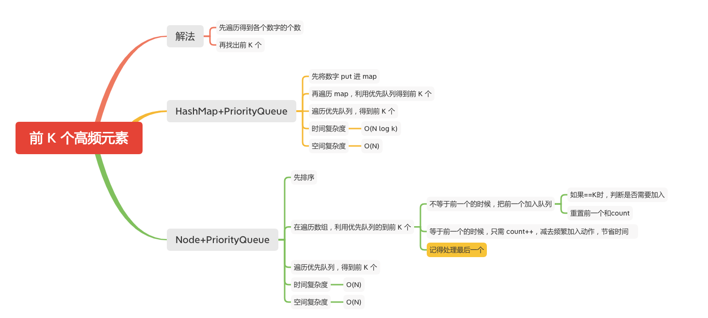

前 K 个高频元素
============



给定一个非空的整数数组，返回其中出现频率前 k 高的元素。

#### 示例 1:
```
输入: nums = [1,1,1,2,2,3], k = 2
输出: [1,2]
```
#### 示例 2:
```
输入: nums = [1], k = 1
输出: [1]
```

#### 提示：
- 你可以假设给定的 k 总是合理的，且 1 ≤ k ≤ 数组中不相同的元素的个数。
- 你的算法的时间复杂度必须优于 O(n log n) , n 是数组的大小。
- 题目数据保证答案唯一，换句话说，数组中前 k 个高频元素的集合是唯一的。
- 你可以按任意顺序返回答案。

### HashMap+PriorityQueue
1.  put 进 map
1. 再遍历 map，利用优先队列得到前 K 个
1. 遍历优先队列，得到前 K 个

```java
    public static int[] topKFrequent1(int[] nums, int k) {
        if (nums == null || nums.length == 0 || k <= 0) {
            return new int[]{};
        }
        Map<Integer, Integer> map = new HashMap<Integer, Integer>();
        for (int num : nums) {
            map.put(num, map.getOrDefault(num, 0) + 1);
        }

        // int[] 的第一个元素代表数组的值，第二个元素代表了该值出现的次数
        PriorityQueue<int[]> queue = new PriorityQueue<int[]>(new Comparator<int[]>() {
            public int compare(int[] m, int[] n) {
                return m[1] - n[1];
            }
        });
        for (Map.Entry<Integer, Integer> entry : map.entrySet()) {
            int num = entry.getKey(), count = entry.getValue();
            if (queue.size() == k) {
                // 等于 K 时候要判断是否比第一个大
                if (queue.peek()[1] < count) {
                    // 比第一个大，退出第一个
                    queue.poll();
                    // 加入新的
                    queue.offer(new int[]{num, count});
                }
            } else {
                // 小于 K 加入队列
                queue.offer(new int[]{num, count});
            }
        }
        int[] ret = new int[k];
        for (int i = 0; i < k; ++i) {
            ret[i] = queue.poll()[0];
        }
        return ret;
    }
```

### Node+PriorityQueue
1. 先排序
2. 在遍历数组，利用优先队列的到前 K 个
   	- 不等于前一个的时候，把前一个加入队列
      		 - 如果==K时，判断是否需要加入
      		 - 重置前一个和count
   - 等于前一个的时候，只需 count++，减去频繁加入动作，节省时间
   - 记得处理最后一个
```java

    public static class Node {
        int val;
        int count;

        public Node(int val, int count) {
            this.val = val;
            this.count = count;
        }

    }

    public static int[] topKFrequent(int[] nums, int k) {
        if (nums == null || nums.length == 0 || k <= 0) {
            return new int[]{};
        }
        // 排序
        Arrays.sort(nums);
        PriorityQueue<Node> queue = new PriorityQueue<>((o1, o2) -> o1.count - o2.count);
        int pre = nums[0];
        int count = 1;
        for (int i = 1; i < nums.length; i++) {
            if (pre != nums[i]) {
                if (queue.size() == k) {
                    // 等于 K 时候，判断是否需要加入
                    if (queue.peek().count < count) {
                        queue.poll();
                        queue.add(new Node(nums[i - 1], count));
                    }
                } else {
                    // 小于 K 直接加入
                    queue.add(new Node(nums[i - 1], count));
                }
                pre = nums[i];
                count = 1;
            } else {
                // 等于前一个继续计数
                count++;
            }
        }
        // 处理最后一个
        queue.add(new Node(pre, count));
        if (queue.size() > k) {
            queue.poll();
        }

        int[] ans = new int[k];
        int idx = 0;
        // 遍历队列
        for (Node node : queue) {
            ans[idx++] = node.val;
        }

        return ans;
    }
```

#### 参考文章

- [347. 前 K 个高频元素](https://leetcode-cn.com/problems/top-k-frequent-elements/)