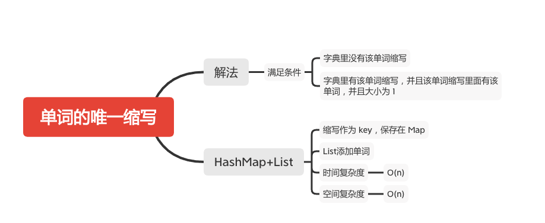

单词的唯一缩写
============



单词的 缩写 需要遵循 <起始字母><中间字母数><结尾字母> 这样的格式。如果单词只有两个字符，那么它就是它自身的 缩写 。

以下是一些单词缩写的范例：

   - dog --> d1g 因为第一个字母 'd' 和最后一个字母 'g' 之间有 1 个字母
   - internationalization --> i18n 因为第一个字母 'i' 和最后一个字母 'n' 之间有 18 个字母
   - it --> it 单词只有两个字符，它就是它自身的 缩写


实现 ValidWordAbbr 类：
   - ValidWordAbbr(String[] dictionary) 使用单词字典 dictionary 初始化对象
   - boolean isUnique(string word) 如果满足下述任意一个条件，返回 true ；否则，返回 false ：
      - 字典 dictionary 中没有任何其他单词的 缩写 与该单词 word 的 缩写 相同。
      - 字典 dictionary 中的所有 缩写 与该单词 word 的 缩写 相同的单词都与 word 相同 。


#### 示例：
```
输入
["ValidWordAbbr", "isUnique", "isUnique", "isUnique", "isUnique"]
[[["deer", "door", "cake", "card"]], ["dear"], ["cart"], ["cane"], ["make"]]
输出
[null, false, true, false, true]

解释
ValidWordAbbr validWordAbbr = new ValidWordAbbr(["deer", "door", "cake", "card"]);
validWordAbbr.isUnique("dear"); // 返回 false，字典中的 "deer" 与输入 "dear" 的缩写都是 "d2r"，但这两个单词不相同
validWordAbbr.isUnique("cart"); // 返回 true，字典中不存在缩写为 "c2t" 的单词
validWordAbbr.isUnique("cane"); // 返回 false，字典中的 "cake" 与输入 "cane" 的缩写都是 "c2e"，但这两个单词不相同
validWordAbbr.isUnique("make"); // 返回 true，字典中不存在缩写为 "m2e" 的单词
validWordAbbr.isUnique("cake"); // 返回 true，因为 "cake" 已经存在于字典中，并且字典中没有其他缩写为 "c2e" 的单词
```

#### 提示：
  - 1 <= dictionary.length <= 3 * 10^4^
  - 1 <= dictionary[i].length <= 20
  - dictionary[i] 由小写英文字母组成
  - 1 <= word <= 20
  - word 由小写英文字母组成
  - 最多调用 5000 次 isUnique

### HashMap+List
```java
    public Map<String, List<String>> map;

    public ValidWordAbbr(String[] dictionary) {
        if (dictionary == null || dictionary.length == 0) {
            return;
        }
        map = new HashMap<>();
        for (int i = 0; i < dictionary.length; i++) {
            String str = dictionary[i];
            if (str != null) {
                String key = fetchKey(str);
                if (map.containsKey(key)) {
                    List<String> list = map.get(key);
                    if (!list.contains(str))
                        list.add(str);
                } else {
                    List<String> strings = new ArrayList<>();
                    strings.add(str);
                    map.put(key, strings);
                }
            }
        }
    }

    public static String fetchKey(String str) {
        StringBuilder key = new StringBuilder();
        if (str.length() <= 2) {
            // 长度小于 2 不用获取缩写
            key.append(str);
        } else {
            key.append(str.charAt(0));
            key.append(str.length() - 2);
            key.append(str.charAt(str.length() - 1));
        }
        return key.toString();
    }

    public boolean isUnique(String word) {
        if (map == null) {
            return false;
        } else {
            if (word == null) {
                return false;
            }
            String key = fetchKey(word);
            return !map.containsKey(key) || map.get(key).contains(word) && map.get(key).size() == 1;
        }
    }
```

#### 参考文章
- [288. 单词的唯一缩写](https://leetcode-cn.com/problems/unique-word-abbreviation/)

