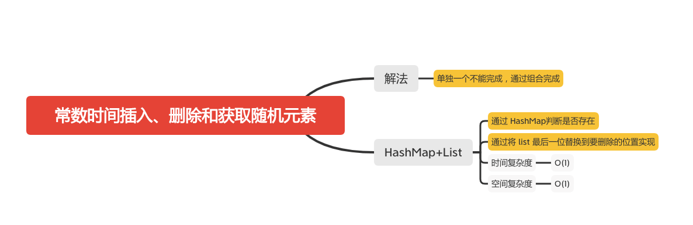

常数时间插入、删除和获取随机元素
==========================



设计一个支持在平均 时间复杂度 O(1) 下，执行以下操作的数据结构。

  1. insert(val)：当元素 val 不存在时，向集合中插入该项。
  1. remove(val)：元素 val 存在时，从集合中移除该项。
  1. getRandom：随机返回现有集合中的一项。每个元素应该有相同的概率被返回。

#### 示例 :
```
// 初始化一个空的集合。
RandomizedSet randomSet = new RandomizedSet();

// 向集合中插入 1 。返回 true 表示 1 被成功地插入。
randomSet.insert(1);

// 返回 false ，表示集合中不存在 2 。
randomSet.remove(2);

// 向集合中插入 2 。返回 true 。集合现在包含 [1,2] 。
randomSet.insert(2);

// getRandom 应随机返回 1 或 2 。
randomSet.getRandom();

// 从集合中移除 1 ，返回 true 。集合现在包含 [2] 。
randomSet.remove(1);

// 2 已在集合中，所以返回 false 。
randomSet.insert(2);

// 由于 2 是集合中唯一的数字，getRandom 总是返回 2 。
randomSet.getRandom();
```

### HashMap+List

```java
    Map<Integer, Integer> map;
    List<Integer> list;
    Random rand = new Random();

    /**
     * Initialize your data structure here.
     */
    public RandomizedSet() {
        map = new HashMap();
        list = new ArrayList();
    }

    /**
     * Inserts a value to the set. Returns true if the set did not already contain the specified element.
     */
    public boolean insert(int val) {
        if (map.containsKey(val)) {
            // 通过 map 判断是否包含
            return false;
        }
        // 添加进 map，记录位置
        map.put(val, list.size());
        // 添加到最后
        list.add(val);
        return true;
    }

    /**
     * Removes a value from the set. Returns true if the set contained the specified element.
     */
    public boolean remove(int val) {
        if (!map.containsKey(val)) {
            // 通过 map 判断是否包含
            return false;
        }
        // 通过替换最后一位实现
        int lastElement = list.get(list.size() - 1);
        // 找到要删除的位置
        int idx = map.get(val);
        // 将最后一位的值设置进去
        list.set(idx, lastElement);
        // 更新最后一个值的位置
        map.put(lastElement, idx);
        // 删除最后一位
        list.remove(list.size() - 1);
        // 删除该值
        map.remove(val);
        return true;
    }

    /**
     * Get a random element from the set.
     */
    public int getRandom() {
        return list.get(rand.nextInt(list.size()));
    }
```

#### 参考文章
- [380. 常数时间插入、删除和获取随机元素](https://leetcode-cn.com/problems/insert-delete-getrandom-o1/)

