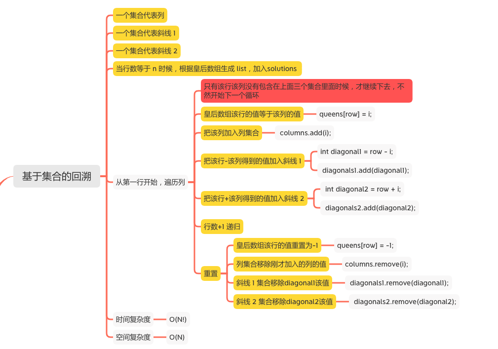
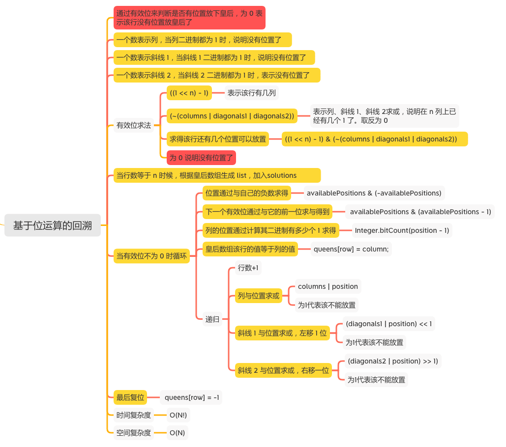

N 皇后
=====

#### [51. N 皇后](https://leetcode-cn.com/problems/n-queens/)





### 基于集合的回溯
```java
    public List<List<String>> solveNQueens(int n) {
        List<List<String>> solutions = new ArrayList<List<String>>();
        int[] queens = new int[n];
        Arrays.fill(queens, -1);
        Set<Integer> columns = new HashSet<Integer>();
        Set<Integer> diagonals1 = new HashSet<Integer>();
        Set<Integer> diagonals2 = new HashSet<Integer>();
        backtrack(solutions, queens, n, 0, columns, diagonals1, diagonals2);
        return solutions;
    }

    public void backtrack(List<List<String>> solutions, int[] queens, int n, int row, Set<Integer> columns, Set<Integer> diagonals1, Set<Integer> diagonals2) {
        if (row == n) {
            List<String> board = generateBoard(queens, n);
            solutions.add(board);
        } else {

            for (int i = 0; i < n; i++) {
                if (columns.contains(i)) {
                    continue;
                }
                int diagonal1 = row - i;
                if (diagonals1.contains(diagonal1)) {
                    continue;
                }
                int diagonal2 = row + i;
                if (diagonals2.contains(diagonal2)) {
                    continue;
                }
                System.out.println("row = " + row + ", column = " + i);
                queens[row] = i;
                columns.add(i);
                diagonals1.add(diagonal1);
                diagonals2.add(diagonal2);
                backtrack(solutions,queens,n,row+1,columns,diagonals1,diagonals2);
                // 重置
                queens[row] = -1;
                columns.remove(i);
                diagonals1.remove(diagonal1);
                diagonals2.remove(diagonal2);
            }
        }
    }

    public List<String> generateBoard(int[] queens, int n) {
        List<String> board = new ArrayList<String>();
        for (int i = 0; i < n; i++) {
            char[] row = new char[n];
            Arrays.fill(row,'.');
            row[queens[i]] = 'Q';
            board.add(new String(row));
        }
        return board;
    }
```
```java
row = 0, column = 0
row = 1, column = 2
row = 1, column = 3
row = 2, column = 1

row = 0, column = 1
row = 1, column = 3
row = 2, column = 0
row = 3, column = 2

row = 0, column = 2
row = 1, column = 0
row = 2, column = 3
row = 3, column = 1

row = 0, column = 3
row = 1, column = 0
row = 2, column = 2
row = 1, column = 1
```

### 基于位运算的回溯
```java
    public List<List<String>> solveNQueens(int n) {
        int[] queens = new int[n];
        Arrays.fill(queens, -1);
        List<List<String>> solutions = new ArrayList<List<String>>();
        solve(solutions, queens, n, 0, 0, 0, 0);
        return solutions;
    }

    public void solve(List<List<String>> solutions, int[] queens, int n, int row, int columns, int diagonals1, int diagonals2) {
        if (row == n) {
            List<String> board = generateBoard(queens, n);
            solutions.add(board);
        } else {
            // ((1 << n) - 1)  表示该行有几列
            // 表示列、斜线 1、斜线 2求或，说明在 n 列上已经有几个 1 了。取反为 0
            int availablePositions = ((1 << n) - 1) & (~(columns | diagonals1 | diagonals2));
            //  // 为 0 说明没有位置了
            while (availablePositions != 0) {
                System.out.println("availablePositions = " + availablePositions);
                // 位置通过与自己的负数求得
                int position = availablePositions & (-availablePositions);
                System.out.println("position = " + position);
                // 下一个有效位通过与它的前一位求与得到
                availablePositions = availablePositions & (availablePositions - 1);

                // 列的位置通过计算其二进制有多少个 1 求得
                int column = Integer.bitCount(position - 1);
                // 皇后数组该行的值等于列的值
                queens[row] = column;
                System.out.println("row = " + row + ", column = " + column);
                System.out.println();
                // 列与位置求或
                // 斜线 1 与位置求或，左移 1 位
                // 斜线 2 与位置求或，右移一位
                solve(solutions, queens, n, row + 1, columns | position, (diagonals1 | position) << 1, (diagonals2 | position) >> 1);
                // 复位
                queens[row] = -1;
            }
        }
    }

    public List<String> generateBoard(int[] queens, int n) {
        List<String> board = new ArrayList<String>();
        for (int i = 0; i < n; i++) {
            char[] row = new char[n];
            Arrays.fill(row, '.');
            row[queens[i]] = 'Q';
            board.add(new String(row));
        }
        return board;
    }
```
```java
availablePositions = 15
position = 1
row = 0, column = 0
availablePositions = 12
position = 4
row = 1, column = 2
availablePositions = 8
position = 8
row = 1, column = 3
availablePositions = 2
position = 2
row = 2, column = 1

availablePositions = 14
position = 2
row = 0, column = 1
availablePositions = 8
position = 8
row = 1, column = 3
availablePositions = 1
position = 1
row = 2, column = 0
availablePositions = 4
position = 4
row = 3, column = 2

availablePositions = 12
position = 4
row = 0, column = 2
availablePositions = 1
position = 1
row = 1, column = 0
availablePositions = 8
position = 8
row = 2, column = 3
availablePositions = 2
position = 2
row = 3, column = 1

availablePositions = 8
position = 8
row = 0, column = 3
availablePositions = 3
position = 1
row = 1, column = 0
availablePositions = 4
position = 4
row = 2, column = 2
availablePositions = 2
position = 2
row = 1, column = 1
```